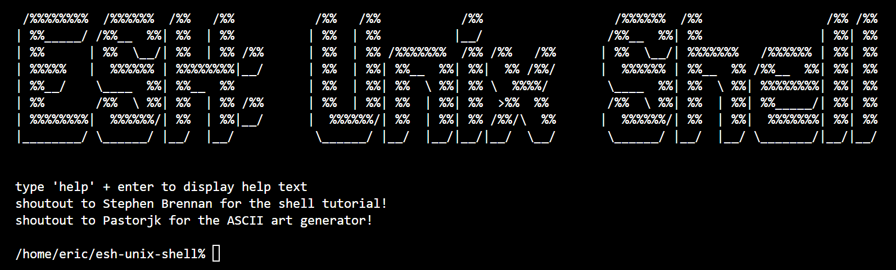

## Overview

This is a basic implementation of a Unix/Unix‑like shell written in C. It follows Stephen Brennan’s tutorial https://github.com/brenns10/lsh but reorganizes the codebase into separate `.c` and `.h` files, along with a `Makefile` for easier compilation and maintenance. The startup banner (ASCII splash art) shown at the beginning of each session and above was generated using patorjk’s ASCII art generator https://patorjk.com/software/taag/.

## Current limitations
This shell is minimal and has several constraints:
* Only whitespace is treated as a separator
* Arguments must appear on a single line
* No quoting or escaping of whitespace
* Many other advanced shell features are not implemented

## Original features from Stephen Brennan’s version
* Built-ins
  * `cd` - change directories
  * `help` - display help text
  * `exit` - exit the shell session

## New features added:
* Startup banner (ASCII splash art) displayed when the shell launches
* Custom PS1 prompt with working‑directory expansion and a `%` prompt symbol
```
/home/user/current/directory% cd ..
/home/user/current%
```

## How to run

Clone the repository and run `make` in the project directory. The compiled binary will appear in the `bin/` folder. Start the shell with:
```
./bin/shell
```
Use it like any other Linux/macOS shell, keeping the noted limitations in mind.

## Future additions

More robust shell features such as quotable arguments and pipes could be additions in the future.
